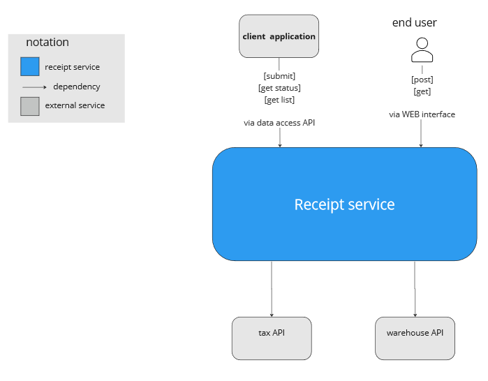
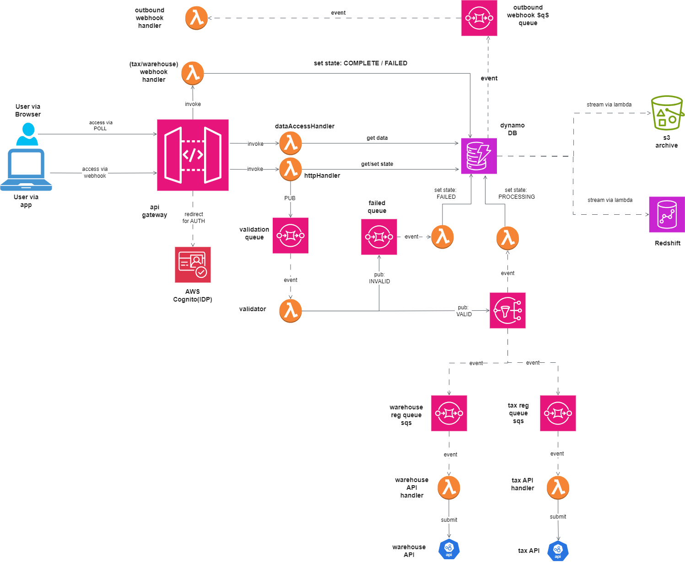
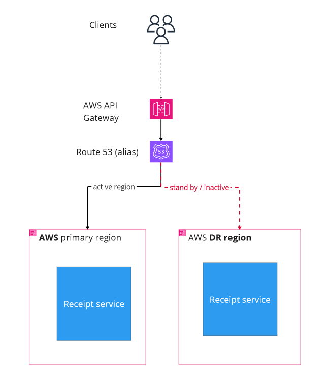

# Receipt registration service

High level problem description: 
---
- система має прийняти чек (JSON, XML документи з різними схемами), перевірити його на 
валідність та зареєструвати в кількох зовнішніх сервісах: податкова, логістика. 
Середній розмір чеку: 2 kB 
- лише після виконання всіх цих перевірок і реєстрацій чек вважається прийнятим. 
Процесс “durable”, тому в процессі реєстрації треба підтримати GET запити з відповідним 
статусом 
- навантаження: робочі часи до 200 чеків в секунду, в часи пік - до 1000, вночі - 0. 
- Безпека - тільки авторизовані сервіси можуть отримати доступ (або тільки на читання, аба 
читання + запис), режим доступа визначається при підписанні контракта на використання 
послуги  
Додаткові аспекти для майбутнього розвитку сервісу: 
- Данні чеків будуть використовуватися в різних складних аналітичних розрахунках, які 
включають аналіз як вглибину (по часу), так і в ширину (по різних клієнтах одночасно) 
Наприклад, аналіз вподобань клієнтів в новорічні свята за останні 20 років 

 Доступ до даних, SLA:  
-  чеки, зареєстровані за останні 30 днів - 0.5 сек, 
 за будь який інший інтервал до 20 років - до 30 сек 
- макс розмір видачі за один раз - 10 000 чеків 
- Доступ для клієнтів: HTTP-based API 
- Рішення має бути сумісним з CD практиками 
- Кількість зовнішніх користувачив/сервісів: будь-яка (10 000+) 

Key Quality Attributes  
---

| Number | Quality/NFR | Numeric Metric (if applicable) | Motivation/Description |
| ---- | ------- | ------------ |-------|
| 1 | Performance  (= peak load support) | for 1000 concurrent users (per second) under 500 ms response time guarantee| |
| 2 | HA and DR| 99 percentile (yearly),  yes ||
| 3 | data complexity | |no given schema upfront |
| 4 | data volume | + 14 TB each year (worst case)||
| 4 | data access | * under 500 ms  - last 30 days   * under 30 s - any other    * page size - 10 000 items||
| 5 | security |  | autorization/authentcation needs to be enforced|
| 6 | extensibility | | * easy to add new receipt types (validation rules)   * easy to extend analycs capabilities/integration with OLTP plafrorms   |
| 7 | cost efficiency | |cost of ownership and cost of operation are key factors  | 
| 8 | AWS based | | AWS is strategic platform| 
---

 
 

# Solution

Context diagram

## Alternatives considered

- (1) serverless, event driven architecture based on: AWS lambdas, AWS SQS, AWS SNS  services 
- (2) "classic" event driven architecture based on: AWS MSK (kafka), AWS EKS (kuberbetes) for hosting compute resources (services)

Rationale and contributing factors (Assumtions)
 - architecture needs to be scalable, elastic, fault tolerant and allowing parallel computing (  -> both (1) and (2) are good choices, being designed for asynchronous message processing )
 - short term cost efficiency is absolutely crucial ( -> (1) wins in short term)
 - no need for multi project integration platforms ( -> (1) wins ) 
 
 Summary : (1) architecture wins

## Option (1): based on lambdas and SQS queues

Component diagram:

## Components description:  

| Component Name | Description | Additional details |
| ---- | ------- | ------------ |
| API Gateway | API gateway is used as HA component allowing easy integration with AWS lambdas and AWS cognito | Receit API exposes  http methods:   GET receipts/{id}   GET receipt/staus/{ticket_id}   POST receipt (payload contains outbound webhook url, for callback scenario, see outbound webhook handler description ofr details)   POST taxApiCallback   (see inbound webhook queue/handler)  POST warehouseAPICallback (see inbound webhook queue/handler)| 
| AWS Cognito | Is used for integration with identiry providers | only authenticated clients can can access API|
| httpHandler Lambdas | handle POST receipt and GET staus methods | each method is served by dedicated lambda |
| dataAccess Lambda | is used to return:    * actual data for receipts of last 30 days   * URL to S3 bucket for receipts older than 30 days  | for results in (1) method exceeding 10K items, paging technique is used: i.e. each result contains page and key (LastEvaluatedKey) to retreive next "page" |
| validation queue | SQS queue containing receipts to validate | Dead letter queue is configured for all SQS queus|
| validation Lambda | lambda handler validating the receipt from the queue:   * if the receipt is valid --> SNS topic "valid receipt" is posted to ( which triggers Tax and Warehouse queues)   * otherwise, failed state queue is updated  | |
| failed state queue | SQS queue updated by validation lambda | DLQ is configured| 
| failed state handler Lambda | lambda handler triggered by failed validation queue, updates the state to FAILED: to receipt_id  | 
| validation Complete SNS topic | SNS topic propagating (aka fan-out) events to downstream SQS queues | | 
| tax API registration queue | SQS queue holding receipts to register with external tax API | | 
| tax API registration handler | lambda handler submitting reiceipts to external tax API service | webhook callback pattern is assumed, inbound webhook queue/handlers are provisioned| 
| warehouse API registration queue | SQS queue holding receipts to register with external warehouse API |  | 
| warehouse API registration handler | lambda handler submitting reiceipts to external warehouse API service | webhook callback pattern is assumed, inbound webhook queue/handlers are provisioned|
| warehouse API external service| external API | webhook callback pattern is assumed| 
| tax API external service |  external API | webhook callback pattern is assumed| 
| PROCESSING state handler Lambda | labda handler updatinf current state for valid receipts | | 
| DynamoDB database | is used as "fast" DB, if partioned properly, it will allow concurrent read/write access by 1000 users per second   *  partition key is - client_id   * (compound) sort key is  DATE#receipt_id (buisness days are used)   * GSI (global secondary index) is set to DATE, to allow easily archive records older than 30 days| to allow pagination in data access api:   * Limit (query page size) is set to 10K   * LastEvaluatedKey's value is used as input/output parameter     Adittionaly, streaming feature is used to:   * archive receipts older than 30 days in s3   * ingest receipts into redshift DB for analytics | 
| Redshift DB| Is used for building complex analytics | data is ingested using dynamoDB streaming or from S3 via batch jobs etc. visual query editor from Redshift can be used| 
| S3 archive| Is used to store archived receipts and/or starting point for ingestion into various analitics platforms and service | | 
| inbound webhook Handler | Lambda function handling POST callbacks from external services | |
| outbound webhook Handler | Lambda function making callbacks (to customers) in reaction to oubound webhook events in outbound webhook queue|| 
| outbound webhook queue | SQS queue updated by dynamodb streams (lambda) based on status change of receipts e.g. PROCESSING->FAILED or PROCESSING->COMPLETE|| 
---

Detailed sequence of actions (e.g. for polling based method) can be found on [this sequence diagram](poll_based_sequence.md)

### Deployment and infrastructure definition

AWS CDK is used to define solution's components, test locally (with localstack) and deploy to cloud

### DR 

Combination of Rout53 and back up AWS accounts is used to achieve DR as shown on the diagram below
DR account account can be used for blue/green deployment pattern

### Ommited concerns   (TODOS)
- Multitenancy
- Analytics platforms details (options)
- integration with specific IDPs and Authorization details
- options how to provide/configure (new) receipt validation algorithms ( to support more types of receipts etc. )
- billing and financial transactions with 3-rd party services