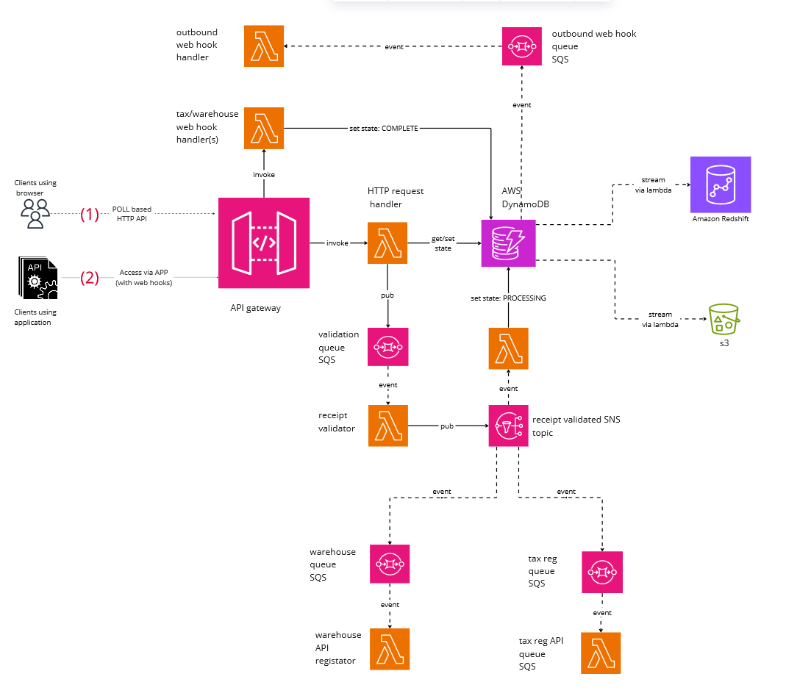

# Receipt registration service

High level problem description: 
---
- система має прийняти чек (JSON, XML документи з різними схемами), перевірити його на 
валідність та зареєструвати в кількох зовнішніх сервісах: податкова, логістика. 
Середній розмір чеку: 2 kB 
- лише після виконання всіх цих перевірок і реєстрацій чек вважається прийнятим. 
Процесс “durable”, тому в процессі реєстрації треба підтримати GET запити з відповідним 
статусом 
- навантаження: робочі часи до 200 чеків в секунду, в часи пік - до 1000, вночі - 0. 
- Безпека - тільки авторизовані сервіси можуть отримати доступ (або тільки на читання, аба 
читання + запис), режим доступа визначається при підписанні контракта на використання 
послуги  
Додаткові аспекти для майбутнього розвитку сервісу: 
- Данні чеків будуть використовуватися в різних складних аналітичних розрахунках, які 
включають аналіз як вглибину (по часу), так і в ширину (по різних клієнтах одночасно) 
Наприклад, аналіз вподобань клієнтів в новорічні свята за останні 20 років 

 Доступ до даних, SLA:  
-  чеки, зареєстровані за останні 30 днів - 0.5 сек, 
 за будь який інший інтервал до 20 років - до 30 сек 
- макс розмір видачі за один раз - 10 000 чеків 
- Доступ для клієнтів: HTTP-based API 
- Рішення має бути сумісним з CD практиками 
- Кількість зовнішніх користувачив/сервісів: будь-яка (10 000+) 

Key Quality Attributes  
---

| Number | Quality/NFR | Numeric Metric (if applicable) | Motivation/Description |
| ---- | ------- | ------------ |-------|
| 1 | Performance  (= peak load support) | for 1000 concurrent users (per second) under 500 ms response time guarantee| |
| 2 | HA and DR| 99 percentile (yearly),  yes ||
| 3 | data complexity | |no given schema upfront |
| 4 | data volume | + 14 TB each year (worst case)||
| 4 | data access | * under 500 ms  - last 30 days   * under 30 s - any other    * page size - 10 000 items||
| 5 | security |  | autorization/authentcation needs to be enforced|
| 6 | extensibility | | * easy to add new receipt types (validation rules)   * easy to extend analycs capabilities/integration with OLTP plafrorms   |
| 7 | cost efficiency | |cost of ownership and cost of operation are key factors  | 
| 8 | AWS based | | AWS is strategic platform| 
---

 
 

# Solution

Context diagram

## Alternatives considered

### Option 1: based on lambdas and SQS queues

Component diagram:

Sequence diagram 

[here](poll_based_sequence.md)

DR / blue green deployment:

